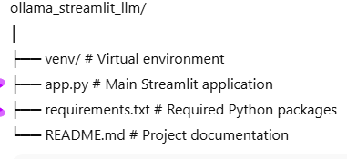

# Local LLM Chat Application (Streamlit + Ollama)

## About the Project
This project is a simple chat-based web application built using Streamlit that connects to a locally installed Large Language Model (LLM) through Ollama.  
The main idea behind this project is to interact with an AI model running completely on the local machine, without relying on any external APIs or internet connection.

The application provides a clean chat interface where users can ask questions and receive responses from the local model. It also keeps track of the conversation and allows resetting the chat when needed.

---

## Tools & Technologies
- Python
- Streamlit
- Ollama
- Requests library
- Python Virtual Environment (venv)

---

## Project Structure

---

## Prerequisites
Before running the project, make sure the following are installed on your system:

1. **Python (3.9 or higher)**
2. **Ollama**

Ollama can be downloaded from:
https://ollama.com

After installation, verify it using:
 - ollama --version

---

## Setting Up the Local Model
Download a local LLM model using Ollama:
ollama pull llama3

You can test the model using:
ollama run llama3

---

## Virtual Environment Setup

Create a virtual environment:
python -m venv venv

Activate the virtual environment (Windows):
venv\Scripts\activate

Once activated, install required dependencies:
pip install streamlit requests

Save installed packages:
pip freeze > requirements.txt

---

## Running the Application
Make sure Ollama is running in the background.

Start the Streamlit app:
streamlit run app.py

The application will open automatically in your web browser.

---

## How the Application Works
- The user enters a query in the chat input box.
- Streamlit sends the query to the local Ollama API.
- The LLM processes the prompt and generates a response.
- The response is displayed in the chat window.
- Conversation history is maintained using Streamlit’s session state.
- A reset button clears the conversation and starts a new session.

---

## Features
- Chat-style interface
- Local LLM execution (offline)
- Conversation history panel
- Reset conversation button
- Virtual environment based setup

---

## Why Use a Local LLM?
- No dependency on internet connection
- Better privacy (data never leaves the system)
- Useful for learning and experimentation
- Suitable for academic projects and demos

---

## Possible Improvements
- Add model selection option
- Enable streaming responses
- Save chat history to a file
- Improve UI styling

---

## Author
Awais Manzoor  
BS Computer Science  
Pakistan

---

## Note
This project is developed for learning, internship and academic purposes.
